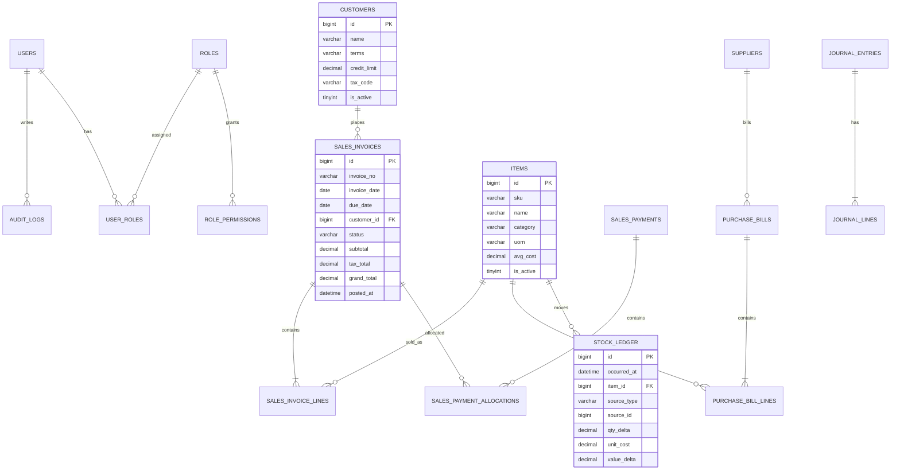
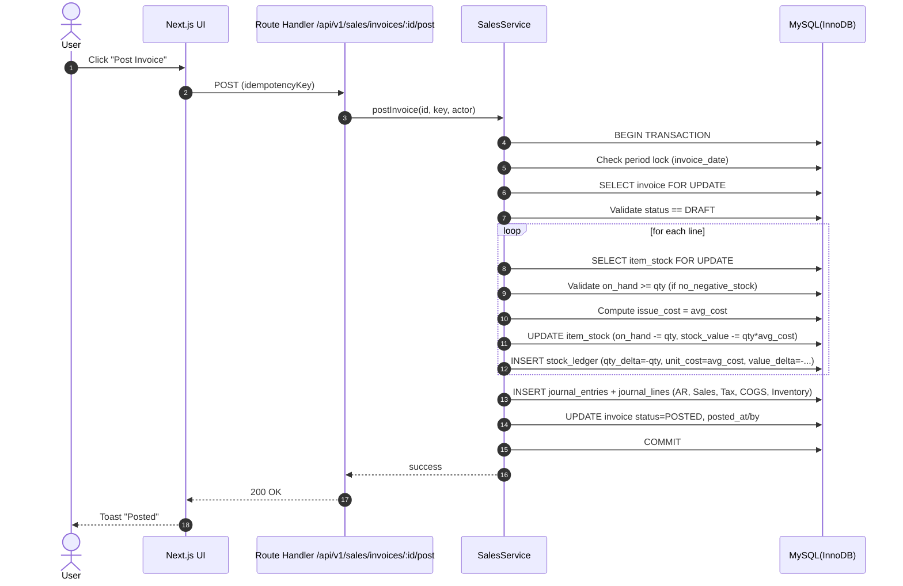
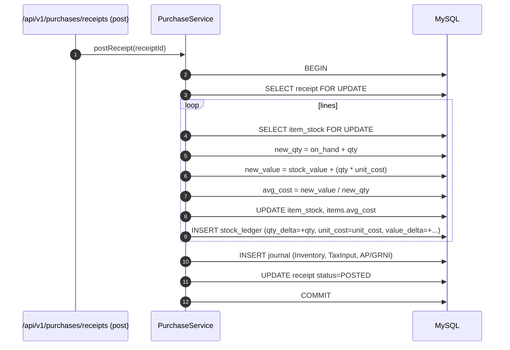
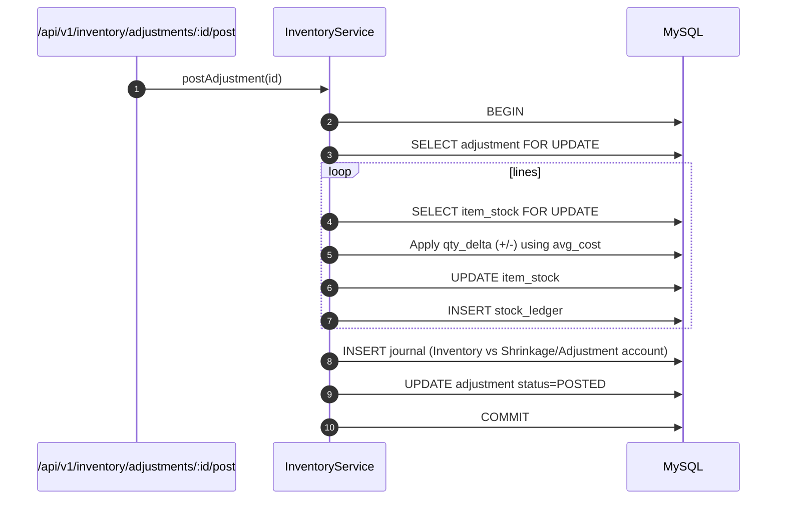
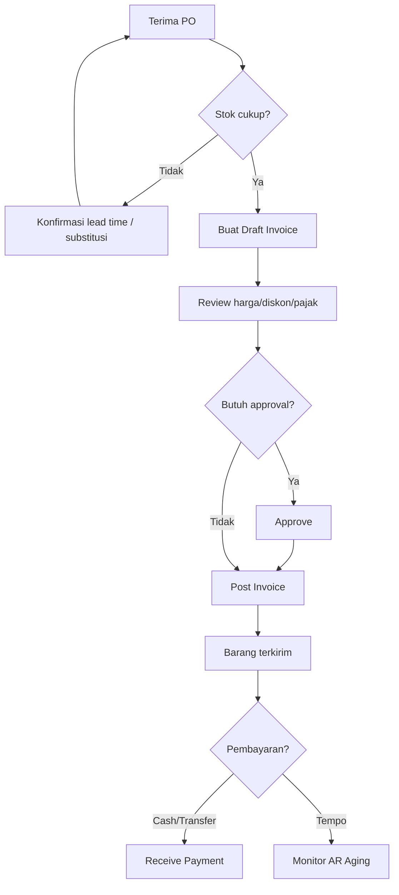

# PRD + SRS Ringkas — Sistem Accounting (Invoicing, Stock, Report) untuk Supplier F&B
**Target:** Sistem internal private (monolith) “setara MYOB 18” untuk **Sales Invoice, Inventory/Stock, Purchasing, Accounting posting otomatis, dan Reporting**.  
**Stack:** Next.js (App Router) + TanStack Query + TypeScript + MySQL (InnoDB).  
**Arsitektur:** **Monolith 1 deployment**, tapi **kode Frontend & Backend dipisah** (layered / modular).

> Referensi teknis utama: Next.js **Route Handlers** (API di folder `app/`) dan konvensi `route.ts` untuk HTTP methods; TanStack Query SSR dehydrate/hydrate; default isolation InnoDB adalah **REPEATABLE READ**; Zod untuk schema validation.  
> - Next.js Route Handlers: https://nextjs.org/docs/app/getting-started/route-handlers  
> - Next.js route file convention: https://nextjs.org/docs/app/api-reference/file-conventions/route  
> - TanStack Query SSR: https://tanstack.com/query/v5/docs/react/guides/ssr  
> - MySQL InnoDB isolation: https://dev.mysql.com/doc/refman/en/innodb-transaction-isolation-levels.html  
> - Zod: https://zod.dev/

---

## 1) Ringkasan Produk
### 1.1 Tujuan
1. Mengelola **penjualan (invoice/credit note/payment)**, **pembelian (bill/receive/pay)**, **persediaan (stock ledger, opname, adjustment)**.
2. Menghasilkan **laporan operasional & keuangan**: sales, AR/AP aging, inventory valuation, P&L, Balance Sheet, Cashflow basic.
3. Menjamin **integritas data**: posting atomic, audit trail, period locking.

### 1.2 Persona & Role (RBAC)
- **Admin**: setup master, user, role, period lock, audit.
- **Sales/CS**: quotation/order/invoice, cek harga & limit kredit.
- **Warehouse**: picking, delivery, stock adjustment, opname.
- **Purchasing**: PO, receive, bill, retur.
- **Finance/Accounting**: payment, pay bills, rekonsiliasi bank, laporan.
- **Owner/Manager**: dashboard KPI, approval diskon/adjustment besar.

### 1.3 Prinsip Desain Akuntansi
- Inventory perpetual + **moving average cost** (recommended untuk supplier F&B).
- Dokumen transaksi **Draft → Posted (immutable)**; pembatalan via **Void/Credit Note**, bukan edit dokumen posted.
- **Stock Ledger** adalah sumber kebenaran pergerakan stok.
- Posting menghasilkan **Journal Entry** otomatis (double entry).

---

## 2) Arsitektur & Struktur Kode (Monolith tapi FE/BE terpisah)
### 2.1 Konsep
- **Satu aplikasi Next.js** untuk UI + API internal.
- API dibuat via **Route Handlers** (`app/api/**/route.ts`).  
- Logic bisnis tidak ditaruh di route handler, tapi di **service layer** (`packages/server/services/**`) agar modular.

### 2.2 Struktur Repository (contoh)
```
repo/
  apps/
    web/                         # Next.js (UI + route handlers)
      app/
        (ui)/
          dashboard/
          sales/
          purchases/
          inventory/
          reports/
        api/
          v1/
            sales/...
            purchases/...
            inventory/...
            reports/...
      src/
        ui/                      # komponen UI
        lib/                     # client utils (fetcher, auth helpers)
  packages/
    shared/
      types/                     # DTO types
      schemas/                   # Zod schemas (request/response)
      constants/                 # error codes, enums
    server/
      services/                  # business logic
      repositories/              # db queries (transactional)
      domain/                    # entities & rules (posting)
      auth/                      # RBAC permission checks
    db/
      migrations/
      seeds/
      schema.md
```

### 2.3 Batasan Layer
- `apps/web/app/api/**` : **HTTP adapter** (auth, parse, call service, return JSON).
- `packages/server/services/**` : **use cases** (create draft, post, void, allocate payment).
- `packages/server/repositories/**` : query DB + transaction.
- `packages/shared/schemas/**` : **Zod** untuk validasi input dan output.

---

## 3) Requirement Fungsional (FR)
> Penomoran: FR-MD (Master Data), FR-S (Sales), FR-P (Purchases), FR-I (Inventory), FR-A (Accounting), FR-R (Reports), FR-ADM (Admin).

### 3.1 Master Data
**FR-MD-01 Customer**
- CRUD customer, alamat billing/shipping, termin, credit limit, tax profile, status.
- Price group default per customer (e.g. HORECA/Reseller/Retail).

**FR-MD-02 Supplier**
- CRUD supplier, termin, tax profile, status.

**FR-MD-03 Item**
- CRUD item: SKU, nama, kategori, UOM, tax code, status.
- Harga: multi price level (list harga), dan bisa override di invoice line.

**FR-MD-04 Chart of Accounts (COA)**
- CRUD akun + tipe (Asset/Liability/Equity/Income/COGS/Expense).
- Mapping akun default: inventory asset, sales income, tax output/input, AR/AP, COGS.

**FR-MD-05 Tax**
- CRUD tax codes: rate, include/exclude, akun pajak.

---

### 3.2 Sales / Invoicing
**FR-S-01 Sales Invoice (Draft)**
- Buat invoice draft dengan line item, diskon, pajak, ongkir (opsional).
- Hitung subtotal/tax/total otomatis.
- Validate: customer aktif, item aktif, qty > 0.

**FR-S-02 Post Invoice (Immutable)**
- Posting invoice menghasilkan:
  - AR bertambah (jika kredit) / cash bertambah (jika cash invoice, opsional).
  - Sales income + tax output.
  - Stock out + jurnal HPP (COGS) dan pengurangan Inventory.
- Jika kebijakan `no_negative_stock = true`, posting ditolak saat stok kurang.

**FR-S-03 Receive Payment**
- Payment inbound: allocate ke satu/lebih invoice; partial allowed.
- Jurnal: DR Bank/Cash, CR AR.
- Status invoice berubah: unpaid → partial → paid.

**FR-S-04 Credit Note / Sales Return**
- Buat credit note refer ke invoice (full/partial).
- Opsi: restock (barang kembali) atau financial-only.
- Jurnal: kebalikan invoice (+ tax reversal).

**FR-S-05 Void Policy**
- Dokumen posted tidak boleh dihapus; void membuat reversal entry (atau credit note).
- Semua aksi void/credit wajib alasan + approval (threshold).

---

### 3.3 Purchasing
**FR-P-01 Receive Items**
- Mencatat penerimaan barang (qty, unit cost, tax).
- Menambah stok (stock ledger).
- Update average cost.

**FR-P-02 Supplier Bill**
- Bill posted menambah AP, mengakui inventory/expense & tax input.

**FR-P-03 Pay Bills**
- Payment outbound: DR AP, CR Bank/Cash.

**FR-P-04 Debit Note / Purchase Return**
- Retur ke supplier, mengurangi stok & nilai, mengurangi AP bila perlu.

---

### 3.4 Inventory
**FR-I-01 Stock Ledger**
- Semua transaksi menghasilkan row ledger: IN/OUT, qty_delta, cost/value_delta, saldo.

**FR-I-02 Costing**
- Moving average:
  - Saat receive: avg_cost = (old_value + receive_value) / (old_qty + receive_qty)
  - Saat issue: issue_cost = avg_cost saat posting.
- Kebutuhan: konsistensi transaksi via DB transaction.

**FR-I-03 Stock Adjustment**
- Adjustment qty +/-, reason code, approval threshold.

**FR-I-04 Stock Opname**
- Buat session opname, input physical count, generate variance, post adjustment.

---

### 3.5 Accounting
**FR-A-01 Auto Journal**
- Setiap posting menghasilkan `journal_entries` & `journal_lines`.

**FR-A-02 Period Lock**
- Lock period (bulan) sehingga transaksi tanggal di periode locked tidak bisa diposting/void.

**FR-A-03 Audit Trail**
- Append-only: create/post/void/approve, old→new (untuk draft), dan metadata.

---

### 3.6 Reporting
**FR-R-01 Sales**
- Sales by customer/item/category, sales trend bulanan, gross margin per item/customer.

**FR-R-02 AR/AP**
- Aging AR/AP per tanggal `asOf`.

**FR-R-03 Inventory**
- Stock on hand, valuation, movement, slow-moving.

**FR-R-04 Financial**
- P&L, Balance Sheet, Trial Balance, GL detail, Cashflow basic.

**FR-R-05 Export**
- CSV/XLSX export role-based.

---

## 4) Non-Functional Requirements (NFR)
### 4.1 Security
- Auth: email+password / internal SSO (opsional).
- Session cookie secure + rotation (recommended).
- RBAC granular per action.
- Rate limit login + endpoint posting.
- Audit log immutable.

### 4.2 Reliability & Performance
- Posting transaksi harus **atomic** (DB transaction).
- Idempotency untuk endpoint posting (anti double submit).
- Index yang tepat untuk laporan (tanggal, status, customer_id, item_id).
- Backup harian + prosedur restore.

### 4.3 Data Integrity (MySQL InnoDB)
- Gunakan transaksi InnoDB; default isolation **REPEATABLE READ** perlu dipahami untuk locking & konsistensi snapshot.  
  (Referensi: MySQL manual).  
- Untuk posting stok: gunakan **SELECT ... FOR UPDATE** pada row ringkasan stok (atau table `item_stock`) agar serialisasi issue/receive.

---

## 5) Domain Rules (Kebijakan Bisnis)
### 5.1 Status Dokumen
- `DRAFT` → `POSTED` → `PARTIALLY_PAID` → `PAID` (invoice)
- `VOIDED` hanya via reversal/credit note; draft boleh `CANCELLED`.

### 5.2 No Negative Stock
- `settings.no_negative_stock = true`:
  - Posting invoice / issue stok wajib memastikan `on_hand >= qty`.
  - Jika tidak cukup, return error detail item.

### 5.3 Approval Threshold
- Diskon > X% atau adjustment > nilai tertentu perlu `APPROVED_BY`.

---

## 6) ERD (Mermaid)


---

## 7) API Spec (REST) — v1
### 7.1 Konvensi
- Base: `/api/v1`
- Content-Type: `application/json`
- Auth: cookie session / bearer (internal)
- Response standar:
```json
{
  "success": true,
  "data": { }
}
```
- Error standar:
```json
{
  "success": false,
  "error": {
    "code": "SLS_INV_POST_STOCK_NEGATIVE",
    "message": "Insufficient stock for 2 items",
    "details": { }
  }
}
```

### 7.2 Error Codes (minimum)
| Code | HTTP | Makna |
|---|---:|---|
| `AUTH_UNAUTHORIZED` | 401 | belum login/invalid session |
| `AUTH_FORBIDDEN` | 403 | tidak punya permission |
| `VALIDATION_ERROR` | 422 | body/query invalid |
| `RESOURCE_NOT_FOUND` | 404 | data tidak ada |
| `CONFLICT` | 409 | nomor dokumen duplikat / status conflict |
| `PERIOD_LOCKED` | 409 | periode sudah closing |
| `IDEMPOTENCY_REPLAY` | 200/409 | request idempotent terdeteksi |
| `SLS_INV_POST_STOCK_NEGATIVE` | 409 | stok kurang saat posting |
| `SLS_INV_ALREADY_POSTED` | 409 | invoice sudah posted |
| `DB_TX_FAILED` | 500 | transaksi DB gagal |

---

## 8) Endpoint List (Lengkap MVP)
### 8.1 Auth & Admin
- `POST /api/v1/auth/login`
- `POST /api/v1/auth/logout`
- `GET  /api/v1/me`
- `GET  /api/v1/admin/permissions`
- `POST /api/v1/admin/users`
- `POST /api/v1/admin/period-locks` (create lock)
- `GET  /api/v1/admin/audit-logs`

### 8.2 Master Data
- Customers: `GET/POST /customers`, `GET/PUT /customers/{id}`
- Suppliers: `GET/POST /suppliers`, `GET/PUT /suppliers/{id}`
- Items: `GET/POST /items`, `GET/PUT /items/{id}`
- COA: `GET/POST /coa`, `GET/PUT /coa/{id}`
- Tax: `GET/POST /tax-codes`, `GET/PUT /tax-codes/{id}`

### 8.3 Sales
- `POST /sales/invoices` (create draft)
- `GET  /sales/invoices?from&to&status&customerId`
- `GET  /sales/invoices/{id}`
- `PUT  /sales/invoices/{id}` (draft only)
- `POST /sales/invoices/{id}/post`
- `POST /sales/invoices/{id}/void` (policy: create reversal)
- `POST /sales/payments`
- `GET  /sales/payments?from&to`
- `POST /sales/credit-notes`

### 8.4 Purchases
- `POST /purchases/receipts` (receive items)
- `POST /purchases/bills`
- `POST /purchases/bills/{id}/post`
- `POST /purchases/payments`
- `POST /purchases/debit-notes`

### 8.5 Inventory
- `GET  /inventory/stock-on-hand?asOf&itemId`
- `GET  /inventory/ledger?from&to&itemId`
- `POST /inventory/adjustments`
- `POST /inventory/opname/sessions`
- `POST /inventory/opname/sessions/{id}/submit`
- `POST /inventory/opname/sessions/{id}/post`

### 8.6 Reports
- `GET /reports/sales-summary?from&to&groupBy`
- `GET /reports/ar-aging?asOf`
- `GET /reports/ap-aging?asOf`
- `GET /reports/inventory-valuation?asOf`
- `GET /reports/pnl?from&to`
- `GET /reports/balance-sheet?asOf`
- `GET /reports/trial-balance?asOf`
- `GET /reports/gl-detail?from&to&accountId`

---

## 9) DTO + Zod Schema (MVP)
> Semua schema diletakkan di `packages/shared/schemas/**`.  
> Zod digunakan untuk parse/validate request dan infer type (lihat dokumentasi Zod).

### 9.1 Common
```ts
import { z } from "zod";

export const Money = z.number().finite();
export const Qty = z.number().finite();
export const ISODate = z.string().regex(/^\d{4}-\d{2}-\d{2}$/);

export const IdempotencyKeyHeader = z.string().min(8).max(128);
```

### 9.2 Sales Invoice — Create Draft
```ts
export const SalesInvoiceLineInput = z.object({
  itemId: z.number().int().positive(),
  qty: Qty.positive(),
  unitPrice: Money.nonnegative(),
  discountRate: z.number().min(0).max(100).default(0),
  taxCode: z.string().min(1),
  memo: z.string().max(255).optional(),
});

export const CreateSalesInvoiceInput = z.object({
  customerId: z.number().int().positive(),
  invoiceDate: ISODate,
  dueDate: ISODate,
  currency: z.string().default("IDR"),
  lines: z.array(SalesInvoiceLineInput).min(1),
  globalDiscountRate: z.number().min(0).max(100).default(0),
  shippingFee: Money.nonnegative().default(0),
  memo: z.string().max(255).optional(),
});
export type CreateSalesInvoiceInput = z.infer<typeof CreateSalesInvoiceInput>;
```

### 9.3 Sales Invoice — Post
```ts
export const PostSalesInvoiceInput = z.object({
  idempotencyKey: z.string().min(8).max(128),
  postDate: ISODate.optional(), // default invoiceDate
});
```

### 9.4 Receive Payment
```ts
export const PaymentAllocationInput = z.object({
  invoiceId: z.number().int().positive(),
  amount: Money.positive(),
});

export const ReceivePaymentInput = z.object({
  customerId: z.number().int().positive(),
  receivedDate: ISODate,
  method: z.enum(["CASH","BANK_TRANSFER","QRIS","OTHER"]),
  bankAccountId: z.number().int().positive().optional(),
  amountTotal: Money.positive(),
  allocations: z.array(PaymentAllocationInput).min(1),
  referenceNo: z.string().max(64).optional(),
  memo: z.string().max(255).optional(),
});
```

### 9.5 Receive Items (Purchases)
```ts
export const ReceiveItemLineInput = z.object({
  itemId: z.number().int().positive(),
  qty: Qty.positive(),
  unitCost: Money.nonnegative(),
  taxCode: z.string().min(1),
});

export const CreateReceiptInput = z.object({
  supplierId: z.number().int().positive(),
  receiptDate: ISODate,
  lines: z.array(ReceiveItemLineInput).min(1),
  referenceNo: z.string().max(64).optional(),
  memo: z.string().max(255).optional(),
});
```

### 9.6 Inventory Adjustment
```ts
export const InventoryAdjustmentLineInput = z.object({
  itemId: z.number().int().positive(),
  qtyDelta: Qty,                // can be negative
  reasonCode: z.enum(["EXPIRED","DAMAGED","LOST","INPUT_ERROR","OTHER"]),
  memo: z.string().max(255).optional(),
});

export const CreateInventoryAdjustmentInput = z.object({
  adjDate: ISODate,
  lines: z.array(InventoryAdjustmentLineInput).min(1),
  memo: z.string().max(255).optional(),
});
```

---

## 10) Database Schema (MySQL DDL) — Core Tables (MVP)
> Engine: InnoDB, charset utf8mb4.  
> Catatan: beberapa kolom disederhanakan; untuk produksi tambahkan `created_at`, `updated_at`, `created_by`, dll.

```sql
CREATE TABLE users (
  id BIGINT PRIMARY KEY AUTO_INCREMENT,
  email VARCHAR(190) NOT NULL UNIQUE,
  password_hash VARCHAR(255) NOT NULL,
  full_name VARCHAR(190) NOT NULL,
  is_active TINYINT NOT NULL DEFAULT 1,
  created_at DATETIME NOT NULL DEFAULT CURRENT_TIMESTAMP
) ENGINE=InnoDB DEFAULT CHARSET=utf8mb4;

CREATE TABLE roles (
  id BIGINT PRIMARY KEY AUTO_INCREMENT,
  code VARCHAR(64) NOT NULL UNIQUE,
  name VARCHAR(190) NOT NULL
) ENGINE=InnoDB DEFAULT CHARSET=utf8mb4;

CREATE TABLE user_roles (
  user_id BIGINT NOT NULL,
  role_id BIGINT NOT NULL,
  PRIMARY KEY (user_id, role_id),
  CONSTRAINT fk_user_roles_user FOREIGN KEY (user_id) REFERENCES users(id),
  CONSTRAINT fk_user_roles_role FOREIGN KEY (role_id) REFERENCES roles(id)
) ENGINE=InnoDB DEFAULT CHARSET=utf8mb4;

CREATE TABLE role_permissions (
  role_id BIGINT NOT NULL,
  perm_code VARCHAR(64) NOT NULL,
  PRIMARY KEY (role_id, perm_code),
  CONSTRAINT fk_role_perm_role FOREIGN KEY (role_id) REFERENCES roles(id)
) ENGINE=InnoDB DEFAULT CHARSET=utf8mb4;

CREATE TABLE audit_logs (
  id BIGINT PRIMARY KEY AUTO_INCREMENT,
  actor_user_id BIGINT NOT NULL,
  action VARCHAR(64) NOT NULL,
  entity_type VARCHAR(64) NOT NULL,
  entity_id BIGINT NOT NULL,
  at DATETIME NOT NULL DEFAULT CURRENT_TIMESTAMP,
  before_json JSON NULL,
  after_json JSON NULL,
  meta_json JSON NULL,
  CONSTRAINT fk_audit_actor FOREIGN KEY (actor_user_id) REFERENCES users(id),
  INDEX idx_audit_entity (entity_type, entity_id),
  INDEX idx_audit_at (at)
) ENGINE=InnoDB DEFAULT CHARSET=utf8mb4;

CREATE TABLE period_locks (
  id BIGINT PRIMARY KEY AUTO_INCREMENT,
  period_start DATE NOT NULL,
  period_end DATE NOT NULL,
  locked_at DATETIME NOT NULL DEFAULT CURRENT_TIMESTAMP,
  locked_by BIGINT NOT NULL,
  memo VARCHAR(255) NULL,
  CONSTRAINT fk_period_lock_user FOREIGN KEY (locked_by) REFERENCES users(id),
  UNIQUE KEY uq_period_range (period_start, period_end)
) ENGINE=InnoDB DEFAULT CHARSET=utf8mb4;

-- Master data
CREATE TABLE customers (
  id BIGINT PRIMARY KEY AUTO_INCREMENT,
  name VARCHAR(190) NOT NULL,
  terms_days INT NOT NULL DEFAULT 0,
  credit_limit DECIMAL(18,2) NOT NULL DEFAULT 0,
  tax_code VARCHAR(32) NOT NULL DEFAULT 'NON',
  is_active TINYINT NOT NULL DEFAULT 1
) ENGINE=InnoDB DEFAULT CHARSET=utf8mb4;

CREATE TABLE suppliers (
  id BIGINT PRIMARY KEY AUTO_INCREMENT,
  name VARCHAR(190) NOT NULL,
  terms_days INT NOT NULL DEFAULT 0,
  tax_code VARCHAR(32) NOT NULL DEFAULT 'NON',
  is_active TINYINT NOT NULL DEFAULT 1
) ENGINE=InnoDB DEFAULT CHARSET=utf8mb4;

CREATE TABLE items (
  id BIGINT PRIMARY KEY AUTO_INCREMENT,
  sku VARCHAR(64) NOT NULL UNIQUE,
  name VARCHAR(190) NOT NULL,
  category VARCHAR(64) NOT NULL,
  uom VARCHAR(32) NOT NULL,
  avg_cost DECIMAL(18,4) NOT NULL DEFAULT 0,
  is_active TINYINT NOT NULL DEFAULT 1
) ENGINE=InnoDB DEFAULT CHARSET=utf8mb4;

-- Optional: fast on_hand table to lock/update safely
CREATE TABLE item_stock (
  item_id BIGINT PRIMARY KEY,
  on_hand DECIMAL(18,4) NOT NULL DEFAULT 0,
  stock_value DECIMAL(18,4) NOT NULL DEFAULT 0,
  updated_at DATETIME NOT NULL DEFAULT CURRENT_TIMESTAMP ON UPDATE CURRENT_TIMESTAMP,
  CONSTRAINT fk_item_stock_item FOREIGN KEY (item_id) REFERENCES items(id)
) ENGINE=InnoDB DEFAULT CHARSET=utf8mb4;

CREATE TABLE tax_codes (
  code VARCHAR(32) PRIMARY KEY,
  name VARCHAR(190) NOT NULL,
  rate DECIMAL(6,4) NOT NULL DEFAULT 0,
  is_inclusive TINYINT NOT NULL DEFAULT 0
) ENGINE=InnoDB DEFAULT CHARSET=utf8mb4;

-- Sales
CREATE TABLE sales_invoices (
  id BIGINT PRIMARY KEY AUTO_INCREMENT,
  invoice_no VARCHAR(64) NOT NULL UNIQUE,
  customer_id BIGINT NOT NULL,
  invoice_date DATE NOT NULL,
  due_date DATE NOT NULL,
  status VARCHAR(24) NOT NULL, -- DRAFT/POSTED/PARTIALLY_PAID/PAID/VOIDED
  subtotal DECIMAL(18,2) NOT NULL DEFAULT 0,
  tax_total DECIMAL(18,2) NOT NULL DEFAULT 0,
  grand_total DECIMAL(18,2) NOT NULL DEFAULT 0,
  memo VARCHAR(255) NULL,
  posted_at DATETIME NULL,
  posted_by BIGINT NULL,
  created_at DATETIME NOT NULL DEFAULT CURRENT_TIMESTAMP,
  CONSTRAINT fk_sales_inv_customer FOREIGN KEY (customer_id) REFERENCES customers(id),
  CONSTRAINT fk_sales_inv_posted_by FOREIGN KEY (posted_by) REFERENCES users(id),
  INDEX idx_sales_inv_date (invoice_date),
  INDEX idx_sales_inv_status (status),
  INDEX idx_sales_inv_customer (customer_id)
) ENGINE=InnoDB DEFAULT CHARSET=utf8mb4;

CREATE TABLE sales_invoice_lines (
  id BIGINT PRIMARY KEY AUTO_INCREMENT,
  invoice_id BIGINT NOT NULL,
  line_no INT NOT NULL,
  item_id BIGINT NOT NULL,
  qty DECIMAL(18,4) NOT NULL,
  unit_price DECIMAL(18,2) NOT NULL,
  discount_rate DECIMAL(6,2) NOT NULL DEFAULT 0,
  tax_code VARCHAR(32) NOT NULL,
  line_subtotal DECIMAL(18,2) NOT NULL,
  line_tax DECIMAL(18,2) NOT NULL,
  line_total DECIMAL(18,2) NOT NULL,
  memo VARCHAR(255) NULL,
  CONSTRAINT fk_sales_line_invoice FOREIGN KEY (invoice_id) REFERENCES sales_invoices(id),
  CONSTRAINT fk_sales_line_item FOREIGN KEY (item_id) REFERENCES items(id),
  CONSTRAINT fk_sales_line_tax FOREIGN KEY (tax_code) REFERENCES tax_codes(code),
  UNIQUE KEY uq_sales_line (invoice_id, line_no),
  INDEX idx_sales_line_item (item_id)
) ENGINE=InnoDB DEFAULT CHARSET=utf8mb4;

CREATE TABLE sales_payments (
  id BIGINT PRIMARY KEY AUTO_INCREMENT,
  customer_id BIGINT NOT NULL,
  received_date DATE NOT NULL,
  method VARCHAR(32) NOT NULL,
  amount_total DECIMAL(18,2) NOT NULL,
  reference_no VARCHAR(64) NULL,
  memo VARCHAR(255) NULL,
  created_at DATETIME NOT NULL DEFAULT CURRENT_TIMESTAMP,
  CONSTRAINT fk_sales_pay_customer FOREIGN KEY (customer_id) REFERENCES customers(id),
  INDEX idx_sales_pay_date (received_date)
) ENGINE=InnoDB DEFAULT CHARSET=utf8mb4;

CREATE TABLE sales_payment_allocations (
  payment_id BIGINT NOT NULL,
  invoice_id BIGINT NOT NULL,
  amount DECIMAL(18,2) NOT NULL,
  PRIMARY KEY (payment_id, invoice_id),
  CONSTRAINT fk_alloc_payment FOREIGN KEY (payment_id) REFERENCES sales_payments(id),
  CONSTRAINT fk_alloc_invoice FOREIGN KEY (invoice_id) REFERENCES sales_invoices(id)
) ENGINE=InnoDB DEFAULT CHARSET=utf8mb4;

-- Purchases
CREATE TABLE purchase_receipts (
  id BIGINT PRIMARY KEY AUTO_INCREMENT,
  supplier_id BIGINT NOT NULL,
  receipt_date DATE NOT NULL,
  status VARCHAR(24) NOT NULL, -- DRAFT/POSTED/VOIDED
  reference_no VARCHAR(64) NULL,
  memo VARCHAR(255) NULL,
  posted_at DATETIME NULL,
  posted_by BIGINT NULL,
  created_at DATETIME NOT NULL DEFAULT CURRENT_TIMESTAMP,
  CONSTRAINT fk_pr_supplier FOREIGN KEY (supplier_id) REFERENCES suppliers(id),
  CONSTRAINT fk_pr_posted_by FOREIGN KEY (posted_by) REFERENCES users(id),
  INDEX idx_pr_date (receipt_date),
  INDEX idx_pr_status (status)
) ENGINE=InnoDB DEFAULT CHARSET=utf8mb4;

CREATE TABLE purchase_receipt_lines (
  id BIGINT PRIMARY KEY AUTO_INCREMENT,
  receipt_id BIGINT NOT NULL,
  line_no INT NOT NULL,
  item_id BIGINT NOT NULL,
  qty DECIMAL(18,4) NOT NULL,
  unit_cost DECIMAL(18,4) NOT NULL,
  tax_code VARCHAR(32) NOT NULL,
  line_value DECIMAL(18,4) NOT NULL,
  CONSTRAINT fk_prl_receipt FOREIGN KEY (receipt_id) REFERENCES purchase_receipts(id),
  CONSTRAINT fk_prl_item FOREIGN KEY (item_id) REFERENCES items(id),
  CONSTRAINT fk_prl_tax FOREIGN KEY (tax_code) REFERENCES tax_codes(code),
  UNIQUE KEY uq_prl (receipt_id, line_no),
  INDEX idx_prl_item (item_id)
) ENGINE=InnoDB DEFAULT CHARSET=utf8mb4;

-- Inventory
CREATE TABLE stock_ledger (
  id BIGINT PRIMARY KEY AUTO_INCREMENT,
  occurred_at DATETIME NOT NULL DEFAULT CURRENT_TIMESTAMP,
  item_id BIGINT NOT NULL,
  source_type VARCHAR(32) NOT NULL, -- SALES_INVOICE, PURCHASE_RECEIPT, ADJUSTMENT, CREDIT_NOTE
  source_id BIGINT NOT NULL,
  qty_delta DECIMAL(18,4) NOT NULL,
  unit_cost DECIMAL(18,4) NOT NULL DEFAULT 0,
  value_delta DECIMAL(18,4) NOT NULL DEFAULT 0,
  balance_qty DECIMAL(18,4) NOT NULL,
  balance_value DECIMAL(18,4) NOT NULL,
  CONSTRAINT fk_ledger_item FOREIGN KEY (item_id) REFERENCES items(id),
  INDEX idx_ledger_item_time (item_id, occurred_at),
  INDEX idx_ledger_source (source_type, source_id)
) ENGINE=InnoDB DEFAULT CHARSET=utf8mb4;

CREATE TABLE inventory_adjustments (
  id BIGINT PRIMARY KEY AUTO_INCREMENT,
  adj_date DATE NOT NULL,
  status VARCHAR(24) NOT NULL, -- DRAFT/POSTED/VOIDED
  memo VARCHAR(255) NULL,
  posted_at DATETIME NULL,
  posted_by BIGINT NULL,
  created_at DATETIME NOT NULL DEFAULT CURRENT_TIMESTAMP,
  CONSTRAINT fk_adj_posted_by FOREIGN KEY (posted_by) REFERENCES users(id),
  INDEX idx_adj_date (adj_date),
  INDEX idx_adj_status (status)
) ENGINE=InnoDB DEFAULT CHARSET=utf8mb4;

CREATE TABLE inventory_adjustment_lines (
  id BIGINT PRIMARY KEY AUTO_INCREMENT,
  adjustment_id BIGINT NOT NULL,
  line_no INT NOT NULL,
  item_id BIGINT NOT NULL,
  qty_delta DECIMAL(18,4) NOT NULL,
  reason_code VARCHAR(32) NOT NULL,
  memo VARCHAR(255) NULL,
  CONSTRAINT fk_adjline_adj FOREIGN KEY (adjustment_id) REFERENCES inventory_adjustments(id),
  CONSTRAINT fk_adjline_item FOREIGN KEY (item_id) REFERENCES items(id),
  UNIQUE KEY uq_adjline (adjustment_id, line_no),
  INDEX idx_adjline_item (item_id)
) ENGINE=InnoDB DEFAULT CHARSET=utf8mb4;

-- Accounting
CREATE TABLE journal_entries (
  id BIGINT PRIMARY KEY AUTO_INCREMENT,
  entry_date DATE NOT NULL,
  source_type VARCHAR(32) NOT NULL,
  source_id BIGINT NOT NULL,
  memo VARCHAR(255) NULL,
  posted_at DATETIME NOT NULL DEFAULT CURRENT_TIMESTAMP,
  posted_by BIGINT NOT NULL,
  CONSTRAINT fk_je_posted_by FOREIGN KEY (posted_by) REFERENCES users(id),
  INDEX idx_je_date (entry_date),
  INDEX idx_je_source (source_type, source_id)
) ENGINE=InnoDB DEFAULT CHARSET=utf8mb4;

CREATE TABLE journal_lines (
  id BIGINT PRIMARY KEY AUTO_INCREMENT,
  journal_entry_id BIGINT NOT NULL,
  line_no INT NOT NULL,
  account_code VARCHAR(64) NOT NULL,
  dc CHAR(1) NOT NULL, -- D/C
  amount DECIMAL(18,2) NOT NULL,
  memo VARCHAR(255) NULL,
  CONSTRAINT fk_jl_je FOREIGN KEY (journal_entry_id) REFERENCES journal_entries(id),
  UNIQUE KEY uq_jl (journal_entry_id, line_no),
  INDEX idx_jl_account (account_code)
) ENGINE=InnoDB DEFAULT CHARSET=utf8mb4;
```

---

## 11) Posting Flow — Sequence Diagram (Mermaid)

### 11.1 Post Sales Invoice (dengan stok + jurnal)


### 11.2 Receive Items (menambah stok & avg cost)


### 11.3 Inventory Adjustment (opname variance)


---

## 12) Flowchart (Business Process)
### 12.1 Sales Invoice


---

## 13) Permission Matrix (contoh MVP)
| Module | View | Create Draft | Post | Void/Credit | Approve | Export |
|---|---|---|---|---|---|---|
| Sales Invoice | Sales/Fin | Sales | Fin | Fin | Manager | Fin/Owner |
| Purchases | Purch/Fin | Purch | Fin | Fin | Manager | Fin |
| Inventory Adj | Wh/Fin | Wh | Fin | Fin | Manager | Fin |
| Reports | All (by role) | - | - | - | - | Owner/Fin |

> Implementasi permission: `perm_code` mis. `SALES_INVOICE_VIEW`, `SALES_INVOICE_POST`, dll.

---

## 14) TanStack Query Requirements (FE)
- Semua list halaman memakai query key standar, contoh:
  - `['salesInvoices', filters]`
  - invalidate setelah post: `queryClient.invalidateQueries({ queryKey: ['salesInvoices'] })`
- SSR prefetch (opsional untuk dashboard):
  - server prefetch → `dehydrate(queryClient)` → hydrate di client (mengikuti guide TanStack Query SSR).

---

## 15) Checklist MVP (Release 1)
1. Master: customer, supplier, item, tax, basic COA mapping.
2. Sales: draft invoice, post invoice (stok+HPP), payment allocate.
3. Purchases: receive items, bill, pay bills (minimal).
4. Inventory: stock ledger, adjustment, stock on hand.
5. Accounting: auto journal, trial balance, P&L basic.
6. Reporting: sales summary, AR/AP aging, inventory valuation.
7. Admin: roles/permissions, period lock, audit log.

---

## 16) Catatan Implementasi Penting (untuk AI Agent)
- Semua aksi `post()` harus:
  1) validasi status, periode, permission  
  2) jalankan DB transaction  
  3) lock row yang relevan (invoice, item_stock)  
  4) insert ledger + journal  
  5) update status posted  
  6) tulis audit log  
  7) commit  
- Gunakan idempotency key untuk mencegah duplicate posting akibat retry/double click.

